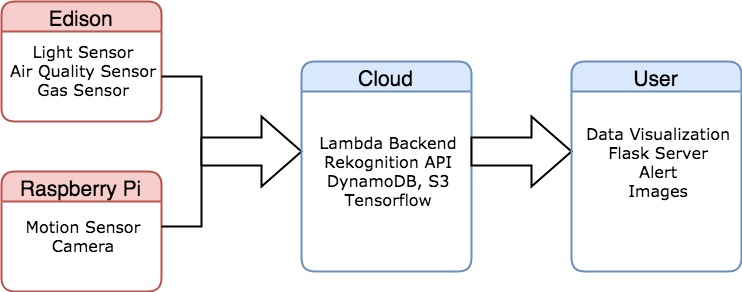
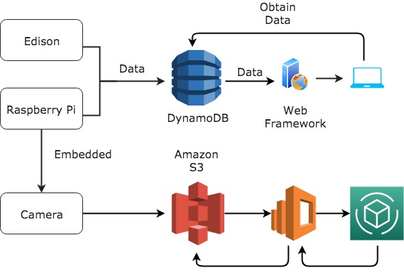
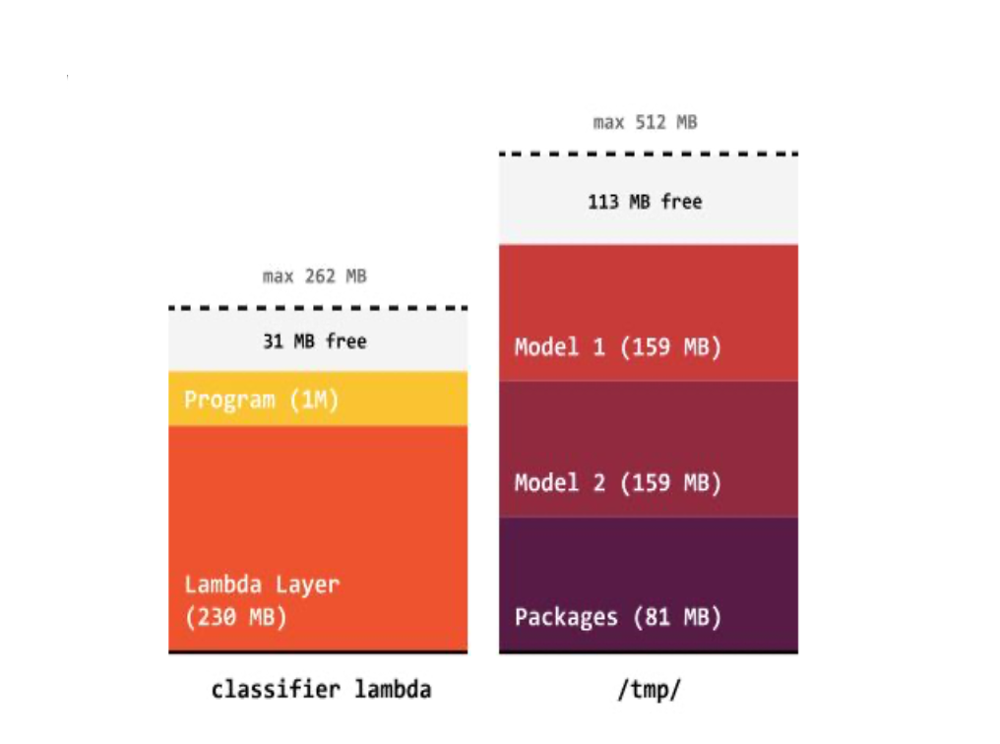
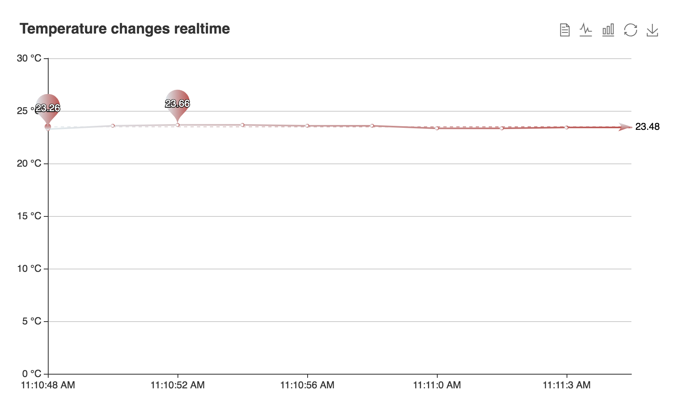
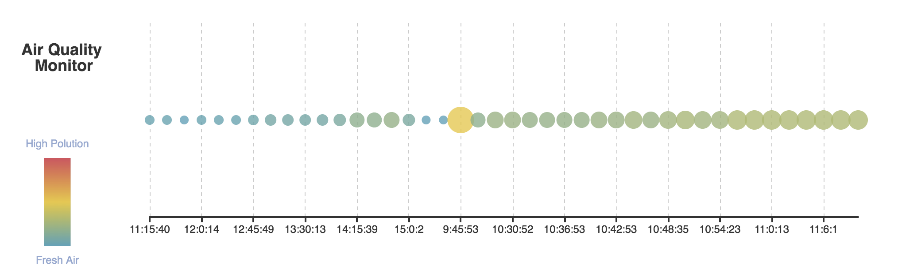

# IoT System of Smart Home Monitor -- Team: COCO

In this project, we designed a smart Home Monitor that could measure, monitor and display the home condition in realtime, and improve the home security with face recognition remotely. Project Website: https://iotcolumbia2019coco.wixsite.com/smarthomemonitor/.

## Built With

* [Flask](https://flask.palletsprojects.com/en/1.1.x/) - The web framework used
* [Intel Edison Board](https://software.intel.com/content/www/us/en/develop/articles/intel-edison-board-user-guide.html) - Used to gather sensor data and send to cloud components
* [Raspberry Pi](https://www.raspberrypi.org/) - Used to gather sensor data and send to cloud components
* [Multiple Sensors](https://en.wikipedia.org/wiki/Sensor): Light Sensor, Air Quality Sensor, Gas Sensor, Motion Sensor, Camera
* [AWS Ecosystem](https://docs.aws.amazon.com/), including AWS DynamoDB, SNS service, Recognition API, S3, Lambda function, and EC2.

## Problem Formulation and Design

To build the entire IoT system of smart home application, we divide system into mainly three parts:

* `Local Terminal`, which serves as gateway in our IoT system. The devices as terminal, namely Edison and Raspberry Pi, gathered sensor data and send to cloud components. Specifically, the Edison board has sensors gather environment data while Pi is used to obtain result from motion sensor and camera.
* `Cloud Computing`, including several cloud service we use.
* `User Feedback Part`, consisting of data visualization tool host in Flask server and alert and photo which is sent to user through AWS SNS service.

## Data Flow & Software Design

Generally, data is transmitted from sensors on embedded device to cloud storage. And then we call backend service for data processing and machine learning, storing back the result to database. We also host another web server to visualize the data in the database. Besides, our web server is deployed in EC2, so user can access the frontend in the server remotely and also on their phones.

* Edison smart home launcher executes two tasks **simultaneously**:
  * First Task: obtain data every 5 minutes, update data in DynamoDB and trigger auto encoder model.
  * Second Task: delete outdated data every hour using batch write strategy to enhance efficiency of DynamoDB operations.
* Motion sensor software: leverage grove kit package to provides asynchronous response, which are nonblocking and can accept callback functions.
* Face recognition model and autoencoder model: deployed in AWS lambda function with Keras based on Tensorflow backend.
* the structure of storage for our
lambda function. The model file and part of packages are stored in S3 rather than directly in the lambda function auxiliary storage space. They will only work together when lambda function is called.

* Web application using Flask framework on cloud server:  to exchange the data between the server and the client based on the RESTful API with Flask and AWS DynamoDB.

  - Realtime Temperature Data Visualization

  - Realtime Air Quality Data Visualization

## Team COCO

* **Lu Liu** - M.S. in Computer Engineering, Columbia University
* **HanZhou Gu** - M.S. in Computer Engineering, Columbia University
* **Chengqi Dai** - M.S. in Computer Engineering, Columbia University

## License

This project is licensed under the MIT License
